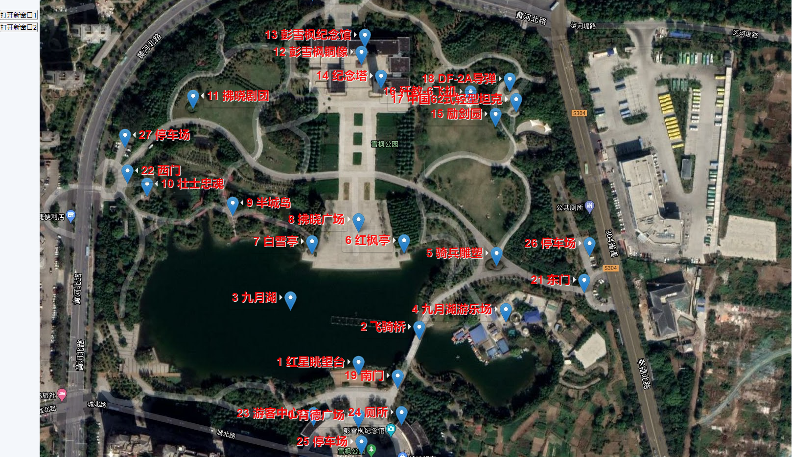

# 一个可以在地图上带标注点进行截图拼接工具
# A tool can screenshot base on big map with marks

[DEMO SITE](http://bms.greenwater.tech)

## 使用说明

坐标体系是基于高德地图，获取坐标可访问高德提供的[工具](https://lbs.amap.com/console/show/picker)。

### 定位中心点

1. 访问主页面。
2. 点击“定位地图”。
3. 输出中心点的坐标。

### 生成带标注信息的卫星图片截图

1. 访问主页面。
2. 在输入框中输入demo.data文件中标注格式的数据，注意结尾中有个逗号。至少要输入四个点。
3. 点击添加景点，标注会出现在地图上。
4. 点击截图，根据缩放大小，左上角会出现多个按钮用于截图（这么设计是为了防止单张图片过大）。
5. 点击左上角按钮，在弹出的新页面中用截图插件（webpage screenshot）进行截图。

成品：

### 获取带有路线的坐标路线数组

1. 访问主页面。
2. 在输入框中输入demo.data文件中路线格式的数据。
3. 拖动两个点中间的点，然后一条线段会变成一个折线，然后每个折线的中间会出现一个新的点。
4. 继续拖动新出现的中间点，直到获取一条完整的路线。
5. 输入框中会出现连续的坐标数组。
6. 如果需要重新修改，需要把坐标数组放入输入框，点击“重新赋值后刷新”。

#### 更多的数据格式参考demo_data.xls